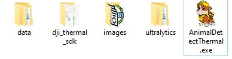

# AnimalDetectThermal

Developer: Dr. `Haitao Lyu` (`hxl170008@utdallas.edu`)

- GitHub: [lyuhaitao (HAITAO LYU) · GitHub](https://github.com/lyuhaitao)

- LinkedIN: [https://www.linkedin.com/in/lyuhaitao](https://www.linkedin.com/in/lyuhaitao/)

Based on Faster R-CNN and YOLOv8, I propose a detection model using deep learning to detect small wild animal objects from thermal images captured by DJI drones.

I utilize PyQT6 to develop a GUI program, which will be an important part in my dotoral disertation final defense.

In addition, I use muti-thread program to accelerate the detection. if there is no GPU in a PC, it will take 35ms to deal with a thermal image (512 x 640).

The model is trained to detect and identify four different animal species: `buffalo`, `deer`, `elephant`, and `rhino`.

| Category | Label |
| -------- | ----- |
| buffalo  | 0     |
| deer     | 1     |
| elephant | 2     |
| rhino    | 3     |

## Overview

Detect small wild animal objects from thermal images captured by UAVs equipped with infrared sensors. In traditional survey methods such as ground-based counting, camera trapping, and aerial surveys, monitoring wild deer in Nepal's Chitwan National Park is challenging due to the dense tall vegetation that often conceals them. The thermal signatures of wild deer contrast sharply against the cooler background, facilitating detection via thermal imaging. However, a large volume of low-resolution images can be captured using Unmanned Aerial Vehicles (UAVs) equipped with thermal cameras to monitor wild deer, where wild animals appear as small objects. Reviewing these images manually is labor-intensive and time-consuming. To address this issue, PI Qiu and Ph.D. student Haitao Lyu  have developed an object detection model using modified Faster R-CNN that automatically identifies small deer objects in thermal images. Instead of VGG 16, the Feature Pyramid Network (FPN) and Residual Neural Network (ResNet152) were employed to enhance feature extraction from these images, constructing multi-scale feature maps that enrich the feature information for small object detection. Customized anchor boxes were also designed to handle the wide variation in object scale and aspect ratios. To improve species identification accuracy for small Regions of Interest (RoIs), a multi-scale aggregation method was proposed, which fuses features from multiple feature maps via Multi-scale RoIAlign pooling. The model proposed in this paper was evaluated by the COCO metrics. The experimental results obtained for the detection of deer and other animals in UAV thermal images with the resolution of 640×512, showing that mean Average Precision (mAP) of 92.3% for all objects, 78.9% for small objects, 94.6% for medium objects, and 95.8% for large objects. This research provides a valuable reference for detecting small objects in low-resolution thermal images and contributes to the field of wildlife monitoring.

|  |  |
| --------------------------------------------------------------- | --------------------------------------------------------------- |

Based on Faster R-CNN and YOLOv8, I propose a detection model using deep learning to detect small wild animal objects from thermal images captured by DJI drones. 

I utilize PyQT6 to develop a GUI program, which will be an important part in my dotoral disertation  final defense.

## Download Application

Click [Download](https://utdallas.box.com/s/qkquvbbpnlke6cxnzmgsrb9c56myd03b) to download the application.

Download URL: [https://utdallas.box.com/s/qkquvbbpnlke6cxnzmgsrb9c56myd03b](https://utdallas.box.com/s/qkquvbbpnlke6cxnzmgsrb9c56myd03b)

It includes a zip file, a .yml file, and a folder.

- AnimalDetectThermal.zip

- test_image. It is a folder that stores the testing thermal images captured by DJI drones.

- env_detect.yml

## Configure Running Environment

- Install `anaconda`

- Open `Anaconda prompt`

- ```conda
  conda env create -f env_detect.yml
  ```

- After runing the command above, a virtual environment `env_detect` will be created.

- Use the command `conda env list` to show the folder path of `env_detect`. Suppose that the path is `D:\env_detect`

- Add `D:\env_detect\Library\bin` to the system environment variable `Path`.

## Unzip AnimalDetectThermal.zip



# Get Started

- duble click `AnimalDetectionThermal.exe` to launch the application


- Click `OpenFile` button to navigate the folder where images are stored. `ListWidge` will list the thumbnail images.

|  |  |
| --------------------------------------------------------------- | --------------------------------------------------------------- |

click a thumbnail image in the left list, and the original image will shown on the right. The bottom of the window shows the basic information of the image you select.

- From the dropdown list of Palette, different palettes can be chosen. The image with the corrsponding palette is shown 
  
  |  |  |
  | --------------------------------------------------------------- | --------------------------------------------------------------- |

- Click the button `Detect` to detect the wild animals in the image you just selected

|  |  |
| --------------------------------------------------------------- | --------------------------------------------------------------- |

- two `RadioButton` `Original Image` and  `Detect Image` are used to control whether an original image is shown or the detected results are shown.

- The button `Batch Process` is clicked. All imported images will be processed by the detection model one by one.  

A dialog window pops up to indicate the progress of the batch detection task

- `Export` button is clicked to export the detection results of current selected image

there are files including a `.jpg` file and a `.txt` file. The `.txt` file has the same name with the image, and it contains the information about `classification`, `confidence`, and the coordinates of bounding boxes `(xmin, ymin, xmax, ymax)`. An example is shown in the following.  

| classification | confidence | xmin | ymin | xmax | ymax |
| -------------- | ---------- | ---- | ---- | ---- | ---- |
| 1              | 0.87       | 320  | 401  | 356  | 451  |

- The button `Batch Export` is clicked to export all detection results.
  
  

- The button `Load Model` is used to update the current model by using a new trainging weight file with the extention `.pt` 
